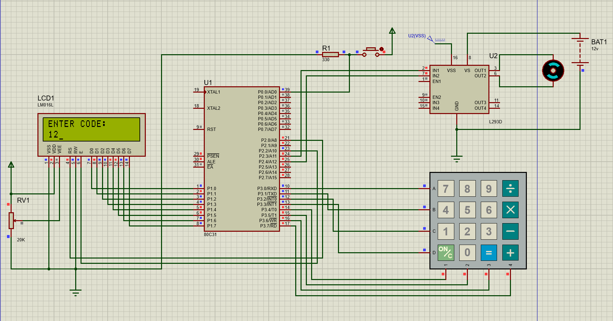

# DoorLock
 Pin code based door lock system with 8051

You can change the default password in the code at <ins>line 285</ins> of `.asm` file
`.pdsprj` is proteus file made for simulation and schematics of the circuit reference purpose
you can also refer to the image and go with the `.asm` file directly instead

## Instance of a simulation in proteus

